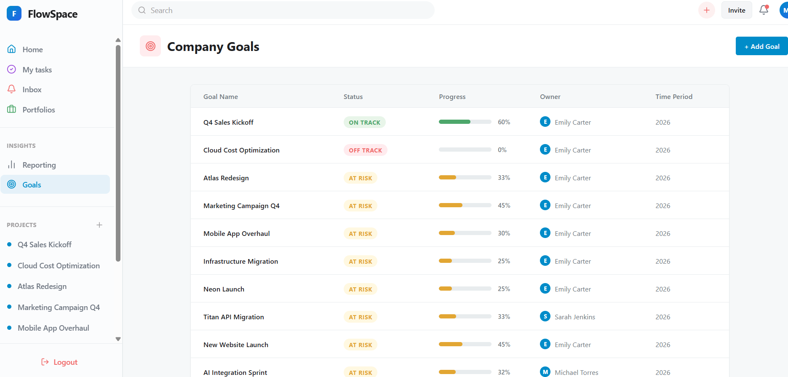

<div align="center">

# 🚀 Project Management Tool (CodeAlpha Task 3)

[](https://task3-frontend-60bc.onrender.com)


</div>
A beautifully designed, full-stack collaborative project management tool built for CodeAlpha. It features Trello-style Kanban boards, real-time collaboration via WebSockets, and a stunning modern Glassmorphism user interface.

<br>

<div align="center">
  
</div>

<br>

## ✨ Key Features

- 🎨 **Premium UI/UX**: State-of-the-art Glassmorphism design with fluid micro-animations and dynamic hover effects.
- 📋 **Interactive Kanban Boards**: Effortlessly drag and drop tasks across customizable columns to track project progress.
- 🔄 **Real-Time Collaboration**: Powered by Socket.io, when one user moves a task or posts a comment, it updates instantly on everyone else's screen!
- 🔔 **Global Notifications & Inbox**: Receive live toast notifications for activities and manage all your updates in a centralized Inbox.
- 🔐 **Secure Authentication**: Full JWT-based user registration and login system.
- 📱 **Fully Responsive**: Optimized to look perfect on both desktop and mobile devices.
- 🌍 **Public Portfolio Mode**: All projects are globally visible so recruiters and visitors can instantly interact with sample data upon registering.

## 🛠️ Technology Stack

**Frontend:**
- React 19 (TypeScript)
- Vite
- Tailwind CSS
- Framer Motion (Animations)
- @hello-pangea/dnd (Drag and Drop)
- Socket.io-client

**Backend:**
- Node.js & Express
- SQLite (Database)
- Socket.io (WebSockets)
- JWT & Bcrypt (Authentication)

## 🚀 Running Locally

If you want to run this project on your local machine, follow these steps:

### 1. Clone the repository
```bash
git clone https://github.com/sankri15/CodeAlpha_ProjectManagement-tool.git
cd CodeAlpha_ProjectManagement-tool
```

### 2. Setup the Backend
```bash
cd backend
npm install
npm run dev
```
*(The backend will run on `http://localhost:5000`)*

### 3. Setup the Frontend
Open a new terminal window:
```bash
cd frontend
npm install
npm run dev
```
*(The frontend will run on `http://localhost:5173`)*

## ☁️ Deployment
This project is fully automated for deployment on [Render](https://render.com) using a custom Blueprint (`render.yaml`). The backend compiles TypeScript to native JavaScript for maximum performance and compatibility.
